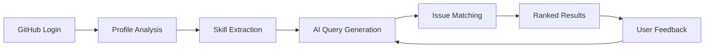

<h2 align="center">🎯 IssueMatch</h2>

<h3 align="center">AI-Powered Open Source Contribution Matchmaker</h3>

<p align="center"><b>IssueMatch</b> connects developers with open source issues that perfectly match their skills and interests using advanced AI and machine learning. Find meaningful contributions in seconds, not hours.</p>

<p align="center"><em>Part of Social Winter of Code 2026</em></p><br>

<div align="center"> 
  
  [](https://python.org)
  [](https://fastapi.tiangolo.com)
  [](https://nextjs.org)
  [](https://typescriptlang.org)
  [](https://mongodb.com)
  
  [](LICENSE)
  [](CONTRIBUTING.md)
  [](https://swoc.tech)
  
</div>
<br>

<div align="center">

> Intelligent platform bridging developers with open source opportunities through AI-powered matching

</div>
<br>

---

### ✨ Features

### 🤖 AI-Powered Matching
- **Smart Profile Analysis**: Extracts skills from GitHub profile
- **Vector Similarity Search**: FAISS-powered matching with 384-dimensional embeddings
- **Intelligent Query Generation**: AI creates optimized GitHub search queries
- **Real-time Learning**: ML system improves recommendations based on feedback

### 👤 User Experience
- **GitHub OAuth**: Secure one-click authentication
- **Interactive Skill Assessment**: 10-question skill evaluation system
- **AI Chatbot Assistant**: AI-powered help for understanding issues
- **Dark/Light Theme**: Modern UI with theme switching

### 🎓 Mentorship & Growth
- **Mentor Matching**: Connect with experienced developers
- **Leaderboard System**: Contribution-based ranking (10/25/50 points)
- **Referral Program**: Earn 5 points per referral
- **Progress Analytics**: Track your open source journey

---

### 🛠️ Technology Stack

### Backend
- **Framework**: FastAPI (Python 3.9+)
- **AI/ML**:
  - Google AI Studio - AI Chatbot
  - FAISS (v1.7.x) - Vector similarity search
  - Sentence Transformers (all-MiniLM-L6-v2) - Text embeddings
- **APIs**: GitHub REST API (2022-11-28)
- **Database**: MongoDB Atlas

### Frontend
- **Framework**: Next.js 15+ (React 19)
- **Language**: TypeScript 5.0+
- **Styling**: TailwindCSS + Shadcn/ui
- **State Management**: React Context API
- **Theme**: next-themes

### Authentication & Storage
- **Auth**: GitHub OAuth 2.0
- **Database**: MongoDB Atlas
- **Session**: Server-side sessions with FastAPI

---

### 🚀 Quick Start

### Prerequisites
```bash
Python 3.9+
Node.js 18+
Git
```

### Installation

1. **Clone the repository**
```bash
git clone https://github.com/AvishkarPatil/IssueMatch.git
cd IssueMatch
```

2. **Backend Setup**
```bash
cd backend
python -m venv venv
source venv/bin/activate  # Windows: venv\Scripts\activate
pip install -r requirements.txt
cp .env.example .env  # Configure your environment variables
uvicorn app.main:app --reload --port 8000
```

3. **Frontend Setup**
```bash
cd frontend
npm install
npm run dev
```

4. **Access the application**
- Frontend: http://localhost:3000
- Backend API: http://localhost:8000
- API Docs: http://localhost:8000/docs

For detailed setup instructions, see [SETUP.md](SETUP.md)

---

### 🔄 How It Works



1. **Authenticate** with GitHub OAuth
2. **Profile Analysis** extracts skills from your repositories
3. **AI Processing** generates optimized search queries
4. **Vector Matching** finds relevant issues using FAISS
5. **Smart Ranking** orders results by relevance
6. **Continuous Learning** improves from user interactions

---

### 📋 To-Do List

- [ ] Real-time leaderboard implementation
- [ ] Dynamic profile statistics
- [ ] Improved UI/UX design
- [ ] Enhanced issue matching algorithm
- [ ] Mentor-mentee matching system
- [ ] Mobile responsive improvements
- [ ] Advanced analytics dashboard
- [ ] Gamification features

---

### 🤝 Contributing

We welcome contributions from developers of all skill levels! This project is part of **Social Winter of Code 2026**.

### Getting Started
1. Check [open issues](https://github.com/AvishkarPatil/IssueMatch/issues)
2. Look for `SWoC26` and difficulty labels (`Easy`, `Medium`, `Hard`)
3. Comment to request assignment
4. Fork, code, and submit a PR

See [CONTRIBUTING.md](CONTRIBUTING.md) for detailed guidelines.

### Contributors
<a href="https://github.com/AvishkarPatil/IssueMatch/graphs/contributors">
  
</a>

---

### 📄 License

This project is licensed under the MIT License - see [LICENSE](LICENSE) for details.

---

<div align="center">
  <p>Built with ❤️ by <a href="https://github.com/AvishkarPatil">Avishkar Patil</a></p>
  <p>© 2026 IssueMatch. All rights reserved.</p>
</div>
